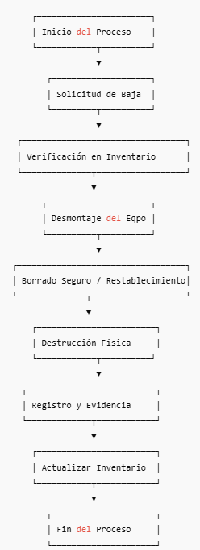

# Procedimiento Estándar para la Destrucción de Equipos en Data Centers

**Versión:** 1.0  

**Clasificación:** Uso Interno  

**Responsable:** Operaciones de Data Center / Seguridad de la Información  

**Nota:** *La informacion presentada en este documento es para propositos educativos, no contiene la informacion real del processo al cual se creo este programa, por cuestion de privacidad y proteccion de la informacion.*

---

## 1. Objetivo

Establecer un procedimiento estándar para la destrucción segura y controlada de equipos y medios en los Data Centers, asegurando el cumplimiento normativo y la protección de información sensible.

---

## 2. Alcance

Este proceso aplica a:

- Servidores físicos  
- Equipos de red (switches, routers, firewalls)  
- Medios de almacenamiento (HDD, SSD, cintas, appliances)  
- Componentes electrónicos que contengan datos o firmware  

---

## 3. Responsabilidades

| Rol | Responsabilidad |
|-----|------------------|
| **Operaciones de Data Center** | Retiro, preparación y verificación de equipos. |
| **Seguridad de la Información** | Validación del método de destrucción y auditoría. |
| **Administrador de Inventario** | Actualización del inventario y registros. |
| **Proveedor Certificado** | Destrucción física y entrega del certificado. |

---

## 4. Proceso General

### 4.1 Solicitud de destrucción

1. Crear una solicitud formal (ticket).  
2. Confirmar aprobación de baja del activo.  
3. Verificar registro de inventario.

---

### 4.2 Desmontaje del equipo

1. Retirar físicamente el equipo del rack o área operativa.  
2. Etiquetar con:
   - ID del activo  
   - Número de serie  
   - Motivo de destrucción  

---

### 4.3 Eliminación de datos (borrado lógico)

Dependiendo del tipo de equipo:

- **Medios magnéticos (HDD):** aplicar borrado seguro (Clear/Purge NIST 800-88).  
- **Medios de estado sólido (SSD):** borrado seguro cuando sea posible, seguido de destrucción física.  
- **Equipos de red:** restablecimiento de fábrica y eliminación de credenciales.  

Registrar: método utilizado, responsable y fecha.

---

### 4.4 Destrucción física

Realizada por personal autorizado o proveedor certificado:

Métodos aceptados:

- Trituración industrial  
- Pulverización o granulación  
- Corte mecánico  
- Desmagnetización certificada (solo medios magnéticos)

**Nota:** Los SSD siempre deben destruirse físicamente.

---

### 4.5 Registro y trazabilidad

Registrar:

- ID del activo  
- Número de serie  
- Método de destrucción  
- Responsable  
- Fecha  
- Evidencias (opcional)  
- Certificado de destrucción (si aplica)

---

### 4.6 Actualización del inventario

1. Marcar el activo como **retirado/destruido**.  
2. Adjuntar certificado.  
3. Cerrar ticket del proceso.

---

## 5. Requisitos de Seguridad

- Solo personal autorizado puede manipular equipos.  
- Áreas de destrucción deben estar controladas.  
- Mantener registro de cada manipulación y traslado.  
- Los equipos no deben salir del Data Center sin custodia.  
- Certificados deben conservarse mínimo por 5 años.

---

## 6. Cumplimiento Normativo

Este proceso se ajusta a:

- ISO/IEC 27001 (Gestión de Activos / Seguridad Física)  
- NIST 800-88 Rev.1 (Media Sanitization)  
- ISO/IEC 27040 (Seguridad de almacenamiento)  
- Regulaciones locales de protección de datos  

---

## 7. Diagrama de Flujo del Proceso

