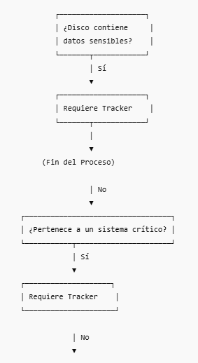
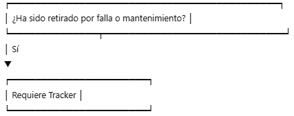
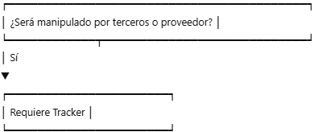
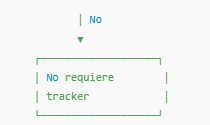

# Criterios para Identificar Discos Duros que Requieren un Tracker de Auditoría

**Versión:** 1.0  
**Clasificación:** Uso Interno  
**Responsable:** Seguridad de la Información / Operaciones de Data Center  

**Nota:** *La informacion presentada en este documento es para propositos educativos, no contiene la informacion real del processo al cual se creo este programa, por cuestion de privacidad y proteccion de la informacion.*
---

## 1. Objetivo

Definir los criterios y el procedimiento para identificar qué discos duros o medios de almacenamiento deben contar con un **tracker de auditoría**, con el fin de asegurar trazabilidad, control y cumplimiento de normativas internas y externas.

---

## 2. Alcance

Este documento aplica a:

- HDD y SSD internos de servidores  
- Medios removibles utilizados para respaldo (cintas, SSD externos)  
- Almacenamientos integrados en appliances  
- Discos retirados por sustitución, falla o mantenimiento  

---

## 3. ¿Qué es un Tracker de Auditoría?

Un **tracker** es un mecanismo de seguimiento obligatorio que registra:

- Estado del disco  
- Ubicación actual  
- Responsable del activo  
- Fecha de movimientos  
- Cambios o manipulaciones  
- Motivos de retiro o traslado  

Puede integrarse en el sistema de inventario, en un módulo de seguridad física o en un sistema de gestión de activos (AMS).

---

## 4. Criterios para Determinar si un Disco Requiere Tracker

Un disco requiere **obligatoriamente** un tracker cuando cumple uno o más de los siguientes criterios:

---

### 4.1 Contiene información sensible o regulada

Requiere tracker si el disco almacenó:

- Datos personales o datos confidenciales  
- Información financiera, legal o contractual  
- Datos de clientes o terceros  
- Información estratégica del negocio  

---

### 4.2 Forma parte de sistemas críticos

Discos pertenecientes a:

- Infraestructura core (bases de datos, sistemas de autenticación, APIs centrales)  
- Plataformas de misión crítica  
- Sistemas donde la pérdida de datos generaría impacto alto  

---

### 4.3 Ha sido retirado por falla

Cuando un disco es retirado por:

- Sectores dañados  
- Fallos imprevistos  
- Alertas S.M.A.R.T.  
- Problemas de rendimiento

Debe tener tracker para evitar pérdida, extravío o manipulación indebida.

---

### 4.4 Sale temporalmente del rack o del Data Center

Todo disco que:

- Es transferido entre áreas  
- Es enviado a diagnóstico o análisis  
- Es movido para mantenimiento de un servidor  

Requiere trazabilidad completa mediante tracker.

---

### 4.5 Se asigna a un proveedor o terceros

Si el disco será manipulado por:

- Técnicos externos  
- Fabricantes (RMA)  
- Laboratorios de diagnóstico  

Debe ser registrado con tracker y acompañado de cadena de custodia.

---

### 4.6 Está en proceso de destrucción

Antes de destrucción física o lógica, **todo disco debe tener tracker** que indique:

- Estado actual  
- Motivo de destrucción  
- Responsable  

Esto evita pérdida de medios con información sensible.

---

## 5. Datos que Debe Registrar el Tracker

El tracker de auditoría debe contener, como mínimo:

- ID del activo  
- Número de serie del disco  
- Tipo (HDD/SSD)  
- Ubicación actual  
- Fecha de cada movimiento  
- Responsable de cada transferencia  
- Motivo del movimiento o retiro  
- Adjuntos (foto, evidencia opcional)

---

## 6. Flujo para Determinar si un Disco Requiere Tracker

---

## 7. Revisión y Auditoría

- Seguridad de la Información revisará trimestralmente los registros del tracker.  
- Auditoría interna puede solicitar historial de cualquier activo.  
- Incumplimientos se deben reportar como incidente de seguridad.

---

## 8. Mejora Continua

La política debe revisarse al menos **una vez al año**, o cuando:

- Cambien los tipos de hardware utilizados  
- Cambien las regulaciones aplicables  
- Se detecten brechas en el seguimiento de activos  

---