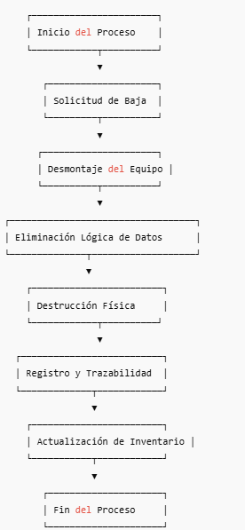

# Información General: Proceso de Destrucción de Equipos en Data Centers

## Objetivo
Garantizar la eliminación segura de equipos y medios de almacenamiento, protegiendo datos sensibles y cumpliendo con las normativas vigentes.

**Nota:** *La informacion presentada en este documento es para propositos educativos, no contiene la informacion real del processo al cual se creo este programa, por cuestion de privacidad y proteccion de la informacion.*

## Alcance
Este proceso aplica a:
- Servidores físicos
- Discos duros (HDD, SSD)
- Equipos de red (switches, routers, firewalls)
- Cualquier hardware que almacene información crítica o sensible

## Roles y Responsabilidades

| Rol | Responsabilidad |
|-----|----------------|
| **Operaciones** | Desmontaje y preparación de los equipos para destrucción |
| **Seguridad de la Información** | Supervisión del proceso, auditoría y validación del cumplimiento de normas |
| **Proveedor certificado** | Destrucción física de los equipos y entrega del certificado correspondiente |

## Flujo General del Proceso
1. **Solicitud de destrucción**: Generación y aprobación de la baja del activo.
2. **Desmontaje del equipo**: Retiro físico y etiquetado.
3. **Eliminación lógica de datos**: Borrado seguro según estándares (p. ej., NIST 800-88).
4. **Destrucción física**: Trituración, pulverización o desmagnetización certificada.
5. **Registro y trazabilidad**: Documentación de cada activo destruido y responsable del proceso.
6. **Actualización de inventario**: Marcar el equipo como destruido y adjuntar certificado.

## Puntos Críticos
- Manejo seguro de datos sensibles
- Registro completo y trazabilidad de cada activo
- Uso de métodos de destrucción certificados y confiables
- Cumplimiento de normativas y estándares (ISO 27001, NIST 800-88)

## Diagrama de Flujo Simplificado

