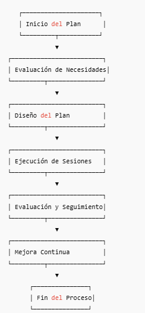

# Proceso Estándar para Generar un Plan de Entrenamiento para Nuevos Asociados

**Versión:** 1.0  
**Clasificación:** Uso Interno  
**Responsable:** Recursos Humanos / Seguridad de la Información / Operaciones  

---

## 1. Objetivo

Definir un proceso estandarizado para diseñar y ejecutar un **plan de entrenamiento para nuevos asociados**, garantizando:

- Familiarización con políticas y procedimientos del Data Center.  
- Comprensión de procesos críticos: destrucción de equipos, manejo de discos con tracker y análisis de datos con Tableau.  
- Seguridad, cumplimiento normativo y trazabilidad de información.

---

## 2. Alcance

Aplica a todos los nuevos asociados que ingresen a:

- Operaciones de Data Center  
- Área de seguridad de la información  
- Análisis de datos o BI (Tableau)  
- Gestión de activos y auditoría  

---

## 3. Roles y Responsabilidades

| Rol | Responsabilidad |
|-----|----------------|
| **RH / Coordinador de Entrenamiento** | Coordinar sesiones, materiales y seguimiento. |
| **Mentor Técnico / Supervisor** | Enseñar procesos críticos, validar competencias. |
| **Seguridad de la Información** | Garantizar cumplimiento de normas de manejo de activos y datos. |
| **Participante (nuevo asociado)** | Completar módulos, evaluar aprendizaje y aplicar conocimientos. |

---

## 4. Proceso General

### 4.1 Evaluación de Necesidades

1. Revisar perfil del nuevo asociado (rol, área, experiencia previa).  
2. Identificar los **módulos necesarios** según la posición:

| Módulo | Contenido |
|--------|-----------|
| Destrucción de equipos | Procedimiento estándar para destrucción física y lógica de equipos en Data Centers. |
| Discos con tracker | Identificación de discos que requieren trazabilidad y registro de auditoría. |
| Tableau | Uso de Tableau para visualización de datos, dashboards, filtros y cálculos. |
| Políticas de seguridad | Roles, permisos, cumplimiento normativo y mejores prácticas. |

---

### 4.2 Diseño del Plan de Entrenamiento

1. Definir **objetivos de aprendizaje** para cada módulo.  
2. Establecer **duración y formato**:

- Sesión teórica (presentación, documentación)  
- Taller práctico (hands-on)  
- Evaluación de conocimientos (quiz, ejercicio práctico)  

3. Asignar **mentores responsables** por módulo.  
4. Preparar **materiales y recursos**:

- Documentos internos (MD, PDFs)  
- Software necesario (Tableau Desktop, Tableau Prep)  
- Accesos a sistemas de inventario y control de activos

---

### 4.3 Ejecución del Plan

1. Programar sesiones según cronograma de incorporación.  
2. Alternar teoría y práctica para reforzar aprendizaje.  
3. Registrar asistencia y resultados de evaluaciones.  

---

### 4.4 Evaluación y Seguimiento

1. Evaluar comprensión mediante:

- Test teóricos  
- Ejercicios prácticos (ej. crear un dashboard en Tableau, registrar discos en tracker, simular proceso de destrucción)  

2. Retroalimentación inmediata del mentor.  
3. Registrar cumplimiento y competencias adquiridas en el **sistema de entrenamiento**.  

---

### 4.5 Mejora Continua

- Revisar cada plan trimestralmente para actualizar contenido.  
- Incorporar nuevas políticas, herramientas o regulaciones.  
- Ajustar duración, materiales y ejercicios según resultados de aprendizaje.  

---

## 5. Diagrama de Flujo del Proceso

---

## 6. Referencias a Contenido Técnico

1. **Destrucción de Equipos en Data Centers**  
   - Procedimientos de borrado seguro y destrucción física de medios.  
2. **Discos con Tracker de Auditoría**  
   - Identificación de discos críticos y registro obligatorio en el tracker.  
3. **Tableau**  
   - Conexión a fuentes de datos, creación de dashboards, filtros y cálculos básicos.  

---

## 7. Documentación Adjunta

- `destruccion-equipos.md`  
- `discos-tracker-auditoria.md`  
- `uso-tableau.md`  

> Nota: Todos los documentos están disponibles en la biblioteca interna de entrenamiento.

---

## 8. Control de Versiones

- Versión 1.0 – Fecha: 2025-12-07 – Elaborado por Recursos Humanos y Seguridad de la Información  
- Próxima revisión programada: 2026-01-01